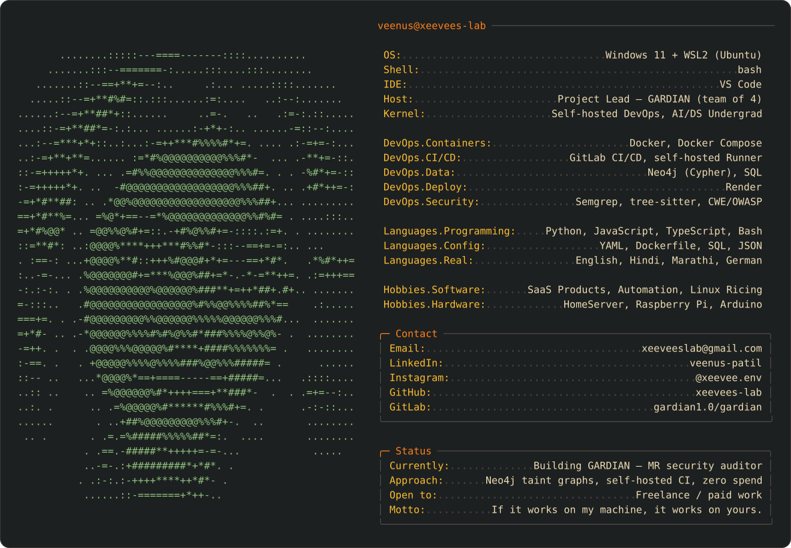

 

---

## Stack

**Infrastructure & CI/CD**

**Security & Data**

**Languages**

---

## GARDIAN

**Graph-Augmented RAG Detection with Intelligent Agent Network** · <!--[gitlab.com/gardian1.0/gardian](https://gitlab.com/gardian1.0/gardian)-->

A self-hosted merge-request security auditor for Python. It flags injection vulnerabilities *before* merge, then posts a patch it has actually executed in a sandbox to prove the fix works.

The point isn't detection — Semgrep already detects. The point is **adjudication**: deciding which findings are real, with grounded evidence, and proving the fix. Semgrep CE runs as the baseline arm in evaluation.

| Stage | How it works |
| :--- | :--- |
| **Candidate generation** | Semgrep CE produces deterministic candidates |
| **Reachability** | Cross-file taint analysis over a Neo4j code property graph, queried in Cypher |
| **Grounding** | RAG over CWE, OWASP and CVEfixes corpora |
| **Adjudication** | Adversarial multi-agent debate via LangGraph |
| **Verification** | Patches executed in a network-isolated Docker sandbox before posting |
| **Delivery** | GitLab CI/CD, self-hosted Runner in Docker |

Built under a hard **zero-cash constraint** — no paid APIs, no cloud GPUs, no managed services. Every component is free-tier or open source, and everything runs locally on WSL2 + Docker. Final-year capstone; I lead a team of four.

`Python` · `Pydantic v2` · `Semgrep` · `tree-sitter` · `Neo4j` · `Cypher` · `LangGraph` · `sentence-transformers` · `Docker` · `GitLab CI`

---

## Stats

Most of my day-to-day commits live on <a href="https://gitlab.com/gardian1.0">GitLab</a>, so the numbers below only tell part of the story.

  

<picture>
  <source media="(prefers-color-scheme: dark)" srcset="https://raw.githubusercontent.com/xeevees-lab/xeevees-lab/output/snake-dark.svg">
  <source media="(prefers-color-scheme: light)" srcset="https://raw.githubusercontent.com/xeevees-lab/xeevees-lab/output/snake.svg">
  
</picture>

---

Open to freelance and paid work &nbsp;·&nbsp; <a href="mailto:xeeveeslab@gmail.com">xeeveeslab@gmail.com</a>

 

